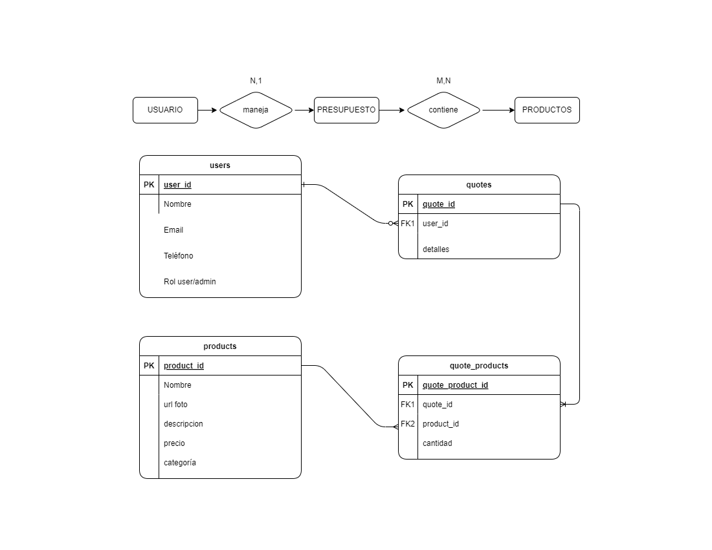
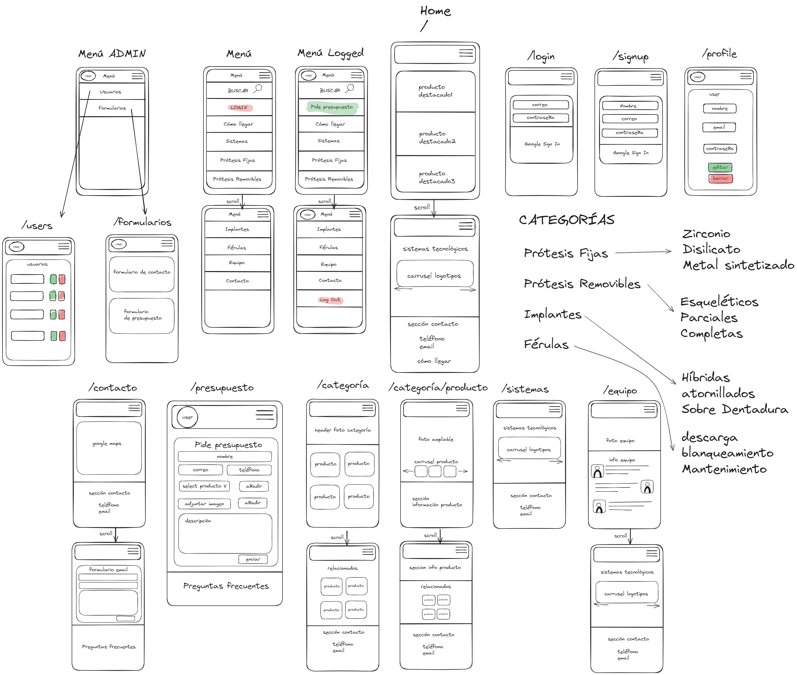

# Laboratorio Dental Monzón - Aplicación Web

Laboratorio Dental Monzón es una aplicación web diseñada para mostrar productos de prótesis dentales y gestionar solicitudes de presupuestos. Permite a los usuarios ver productos en cuatro categorías diferentes, a los usuarios registrados enviar solicitudes de presupuesto, y a los administradores gestionar estas solicitudes.


### Objetivos
- ✅ **Frontend con React:** Implementación de componentes funcionales de React.
- ✅ **Backend con Node.js y Express:** Desarrollo del servidor usando Node.js y Express.
- ✅ **Diseño Responsive:** Aplicación mobile-first y SPA con semántica HTML5.
- ✅ **Estilos con SASS:** Utilización de SASS para los estilos de la aplicación.
- ✅ **Base de datos SQL:** Implementación de PostgreSQL como base de datos.
- ✅ **Control de versiones:** Uso de GitHub desde el inicio del proyecto.
- ✅ **Documentación:** README y buenas prácticas de código.
- ✅ **Gestión del proyecto:** Uso de Trello siguiendo metodología Scrum.
- ✅ **Despliegue:** Despliegue de la aplicación en Render.
- ⬜ **ORM:** Integración de Sequelize (planificado para Fase 2).
- ⬜ **Autenticación avanzada:** Implementación de jsonwebtoken y persistencia de datos (planificado para Fase 2).
- ⬜ **Actualizar usuarios y presupuestos:** editar datos de usuario (planificado para Fase 2).
- ⬜ **Testing:** Realización de pruebas de la aplicación (planificado para Fase 2).
- ⬜ **Documentación:** Documentación con Swagger y JSDoc (planificado para Fase 2).
- ⬜ **Mejoras Frontend:** Carrusel de fotos en la tarjeta de producto, vídeos, marcas y herramientas utilizadas, formulario de contacto para usuarios no registrados, Google Sign In (planificado para Fase 2).


## Estructura de Carpetas
La aplicación sigue una estructura organizada para facilitar el mantenimiento y escalabilidad:

- **client:** Contiene toda la aplicación de React.
  - **src:** Código fuente de React.
    - **assets:** Imágenes y recursos.
    - **components:** Componentes reutilizables.
    - **context:** Componentes de contexto.
    - **styles:** Archivos SASS.
    - **public:** Archivos estáticos.
- **carpeta raíz:** Contiene el servidor Express.
  - **controllers:** Lógica de los endpoints.
  - **models:** Modelos de datos.
  - **routes:** Definición de rutas.
  - **validators:** Validaciones de datos.
  - **config:** Configuraciones de la base de datos.
  - **queries:** Peticiones parametrizadas para la base de datos.

## Funcionalidades Principales


- **Nivel Usuario:**
  - Visualización de productos en cuatro categorías.
  - Registro y autenticación de usuarios.
  - Envío de solicitudes de presupuesto para usuarios registrados.
- **Nivel Administrador:**
  - Visualización y eliminación de presupuestos.

## Modelos lógicos



## Diseño de producto


## Configuración y Uso

1. **Instalación de Dependencias:**
   ```bash
   npm install
   ```

2. **Variables de Entorno:**
   - Crea un archivo `.env` en el directorio raíz y configura las variables necesarias.

3. **Scripts:**
   - `npm start`: Inicia el servidor en modo producción.
   ```bash
   npm start
   ```
   - `npm run server`: Inicia el servidor con nodemon para desarrollo.
   ```bash
   npm run server
   ```
   - `npm run client`: Inicia el cliente React.
   ```bash
   npm run client
   ```
   - `npm run dev`: Inicia tanto el servidor como el cliente concurrentemente para desarrollo.
   ```bash
   npm run dev
   ```
   - `npm run build`: Instala las dependencias y construye el cliente.
   ```bash
   npm run build
   ```

4. **Desarrollo:**
   Para trabajar en el proyecto en modo desarrollo, ejecuta:
   ```bash
   npm run dev
   ```
   Esto iniciará tanto el servidor backend como la aplicación cliente de React.

5. **Construcción para Producción:**
   Para preparar la aplicación para producción:
   ```bash
   npm run build
   ```
   Esto instalará todas las dependencias y construirá la aplicación cliente.

6. **Despliegue:**
   Para desplegar en plataformas como Render, puedes usar:
   ```bash
   npm run render-build
   ```
   Este comando está configurado para instalar dependencias y construir el cliente.

## Contribución

Si deseas contribuir a este proyecto, por favor sigue estos pasos:

1. Haz un fork del repositorio.
2. Crea una nueva rama para tu característica (`git checkout -b feature/AmazingFeature`).
3. Haz commit de tus cambios (`git commit -m 'Add some AmazingFeature'`).
4. Haz push a la rama (`git push origin feature/AmazingFeature`).
5. Abre un Pull Request.

Por favor, asegúrate de seguir los estándares de código establecidos y de incluir pruebas para nuevas características cuando sea posible.

## Autor

Eduardo Fatou Cerrato.